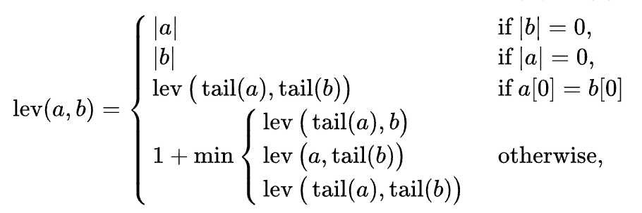

# Spell Checker Algorithm

Spell checker algorithms are widely used in many places in the current software applications.
But the journey started many days earlier.

## How do we check a word is correct or not?
For checking a word is correct or not, we have to define a collection of correct words (dictionary) somewhere
and need to check if the word exists inside the dictionary then we can tell this is a correct word.
If the dictionary stores words in a sorted way then we could check the correctness of a word in O(n log n) time
complexity.

## This is only checking the correctness, but what about the suggestions?
We see in many places the spell checkers not only detect the misspells, but also suggest a bunch of correct
words. How to do it? One possible solution could be performing some operations to the misspelled word.

Consider the word "sill". We are going to type the word "still" but missed the "t" here. So we could perform a
1. insertion
2. deletion
3. substitution
operations to generate some similar word suggestions. Say, we can generate the suggestions like-
- still (performing insertion)
- ill (performing deletion)
- will (performing substitution)

Here we are performing a single letter insertion, deletion, and substitution operation. But the the problem is,
performing single letter operations are not enough for correcting the misspelled word __"speelin"__.

For correcting this we need to perform multiple letter insertion, deletion and substitutions.

## Levenshtein Distance Algorithm

Soviet scientist "Levenshtein" invented an algorithm
to calculate the distance or cost of transforming one
word into another.

According to this algorithm, if we want to transform the word

hat --> can

we can do it by performing two substitution operation.
That is, substitute h with c and t with n. So how could
we calculate that? See the picture.

## This is cool, but there is a problem.
Although by using this algorithm, we can detect
the distance of transforming one word into another
but it uses three recursive calls that causes O(3^n)
time complexity. So, for the big words, it may exceed
the call stack limit. So, this is not so optimal.

The algorithm was not invented for computer algorithm,
it is a mathematical function.

## The mighty Wagner & Fischer dynamic algorithm
Wager & Fischer proposed a huge improvement of the Levenshtein's algorithm.
They used dynamic approach to break the problem into sub problems
and proceed the next step with the help of the previous step.

Lets transform

BOATS --> FLOAT

1. Append an empty string with both strings (_BOATS & _FLOAT) _ means empty string
2. Generate a 2D matrix for storing the levenshtein distance values for every subsets
3. First calculate the first row and the first column values
4. Then match all the letters and calculate the distance accordingly.

#### links
https://hyperskill.org/learn/step/35106
https://www.youtube.com/watch?v=d-Eq6x1yssU
